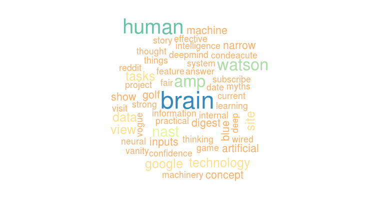

<style>

.title-slide {
  background-color: #FFF; /* #EDE0CF; ; #CA9F9D*/
}
em {
  font-style:italic;
  color:#999;
}
code {
  font-size: 0.8em;
}
</style>

## What is a Word Cloud

*"A Word Cloud is a visual representation of text data, typically used to depict keyword metadata (tags) on websites, or to visualize free form text."* [Wikipedia][wiki]

[wiki]: https://en.wikipedia.org/wiki/Tag_cloud

<div style="text-align:center">

        

</div>

A word cloud can be considered a first visual exploratory step into text analysis.

--- 

## The application


The [Shiny application][app] analyses the body copy of a given webpage, produces a word cloud and a ordered list of the most relevant terms.
The application uses the ``tm`` library to perform the main textual analysis as follows, for example when analysing the phrase

```{r}
sampleText = "A tag cloud (word cloud, or weighted list in visual design).[...]"
```

The analysis of the corpus will highlight that the the word ``cloud`` is the most frequent occurring 2 times:

```{r, warning= F}
library(tm)
myCorpus = Corpus(VectorSource(sampleText))
myCorpus = tm_map(myCorpus, content_transformer(tolower)); myCorpus = tm_map(myCorpus, removePunctuation)
myCorpus = tm_map(myCorpus, removeWords, c(stopwords("SMART"), "and", "but", "the"))
myDTM = TermDocumentMatrix(myCorpus, control = list(minWordLength = 1))
terms <- sort(rowSums(as.matrix(myDTM)), decreasing = TRUE)
head(terms, n=1)
```

---

## Filtering options

When trying to analyse frequent words in a text it is important that some common words like _and_, _but_, _the_ are not considered in the analysis as those are generally always in abundance and not relevant to the topic.

The application automatically excludes those words however there may be other words that cannot be predicted beforehands which are common in the body copy of a webpage but still have little relevance within the topic at hand. (For example a page with multiple social links might present the word _"share"_  throughout the copy but hold no real significance to the analysis performed. )

The application provides custom filtering options in order to render more flexible the analysis as follows:

1. Optional field for the exclusion of common words
2. Specification of frequency range (upper and lower bound)
3. Max number of words to be analysed

[app]:https://gromag.shinyapps.io/wordcloud

---

## Conclusion

This application has allowed me to experiment with [Shiny][shiny] which is a simple but powerful framework that allows to use R programming language on a Web Server. A vast array of widgets and plotting options makes this framework very appealing to Data Scientists.

[shiny]: http://shiny.rstudio.com/
### Source

App: [https://github.com/gromag/wordcloud][source]
Slides: [https://github.com/gromag/wordcloud-pitch/tree/gh-pages][slides]
### Licence

The MIT License (MIT)

### Disclaimer

This analysis was done as a course project for the 'Developing Data Products' course which is part of the [Data Science Specialisation][dss] provided by [Johns Hopkins Bloomberg School of Public Health][jhsph] via [Coursera][co].


[dss]: https://www.coursera.org/specialization/jhudatascience/1
[jhsph]: http://www.jhsph.edu/
[co]: https://www.coursera.org/
[source]: https://github.com/gromag/wordcloud
[slides]: https://github.com/gromag/wordcloud-pitch/tree/gh-pages
